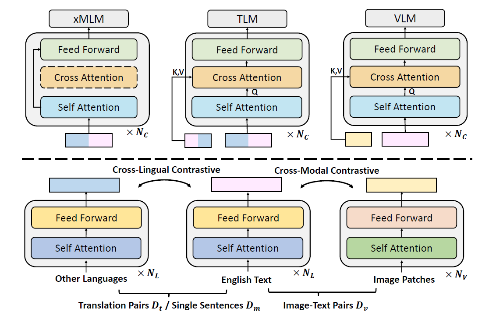

# Unifying Cross-Lingual and Cross-Modal Modeling Towards Weakly Supervised Multilingual Vision-Language Pre-training

## Introduction

This repository is the implementation of our ACL 2023 paper [Unifying Cross-Lingual and Cross-Modal Modeling Towards Weakly Supervised Multilingual Vision-Language Pre-training](https://arxiv.org/abs/2201.12596). In this paper, we explore to perform mVLP (multilingual vision-language pre-training) under the **weakly-supervised setup**: no multilingual image-text pairs are provided while only English image-text pairs and multilingual texts are available. We unify cross-modal and cross-lingual modeling into one joint pre-training framework. The procedure is illustrated in the figure below:



Part of the implementation is based on the project [Oscar&VinVL](https://github.com/microsoft/Oscar) and [ALBEF](https://github.com/salesforce/ALBEF), many thanks to Microsoft and Salesforce for the open-source resource.

## Installation

```bash
# create environment
conda create --name weak_mvlp python=3.9
conda activate weak_mvlp

# install pytorch (you can install the version that fit your GPU! >=1.8.0 is recommended!)
pip install torch==1.12.1+cu113 torchvision==0.13.1+cu113 torchaudio==0.12.1 --extra-index-url https://download.pytorch.org/whl/cu113

# run setup
python setup.py build develop

# install requirements
pip install -r requirements.txt
```

The pre-trained checkpoint are available [here](https://drive.google.com/file/d/16TNcpCXUGwBwtm4q-HMdxyCbUfEv1yw-/view?usp=sharing), our model architecture follows the base setting.

## Usage

In this section, we will introduce how to use our code, including cross-lingual transfer in IGLUE, multilingual retrieval in COCO and Multi30K, and pre-training. 

### Cross-lingual Transfer on IGLUE

To prepare the datasets in IGLUE, please follow the instruction [here](https://github.com/e-bug/iglue). Notice that we only provide command for training on English data and perform zero-shot transfer on other languages. If you are interested in the few-shot performance, you can modify the training data configure to do so.

#### xVNLI

1. Prepare the data and then correctly modify the data path in the corresponding configure file in [albef/configs/xVNLI/cls_base_xVNLI_xlm-r_freeze_single.yaml](https://github.com/FudanDISC/weakly-supervised-mVLP/blob/master/albef/configs/xVNLI/cls_base_xVNLI_xlm-r_init_freeze_single.yaml).

2. Performe training on English data through:

```bash
python cvlm/run_xVNLI_albef.py \
    --albef_config albef/configs/xVNLI/cls_base_xVNLI_xlm-r_init_freeze_single.yaml \
    --model_name_or_path $PRETRAINED_CKPT \
    --tokenizer_name xlm-roberta-base \
    --do_train --do_lower_case --save_epoch 1 \
    --per_gpu_train_batch_size 64 --learning_rate 0.00002 \
    --per_gpu_eval_batch_size 128  --test_lang all \
    --num_train_epochs 10 --weight_decay 0.05  --gradient_accumulation_steps 1 \
    --max_seq_length 40  --evaluate_during_training  --logging_steps 20  --time_debug \
    --output_dir output_xVNLI/  --image_dir_format local
```

3. Perform zero-shot transfer by testing on other languages:

```bash
python3 cvlm/run_xVNLI_albef.py \
    --albef_config albef/configs/xVNLI/cls_base_xVNLI_xlm-r_freeze_single.yaml \
    --eval_model_dir output_xNLI/checkpoint-x-xxxx/ \
    --tokenizer_name xlm-roberta-base --image_dir_format local \
    --do_test --do_eval --eval_split test \
    --per_gpu_eval_batch_size 32 --max_seq_length 50 \
    --test_lang all --output_dir output_xVNLI/evaluation/
```
Notice that you can replace the "--eval_split test" argument with "--eval_split translate_test" to perform translate testing!

#### xGQA

1. Prepare the data and then correctly modify the data path in the corresponding configure file in [albef/configs/xGQA/qa_base_xGQA_xlm-r_init_freeze_single.yaml](https://github.com/FudanDISC/weakly-supervised-mVLP/blob/master/albef/configs/xGQA/qa_base_xGQA_xlm-r_init_freeze_single.yaml) and download the ans2label mapping [here](https://drive.google.com/file/d/1pKD9ZEFbR15oysxAbe1DNU0yYVMwzOlR/view?usp=sharing) to transform the QA task to classification.

2. Performe training on English data through:

```bash
python3 cvlm/run_xGQA_albef.py \
    --albef_config albef/configs/xGQA/qa_base_xGQA_xlm-r_init_freeze_single.yaml \
    --model_name_or_path $PRETRAINED_CKPT \
    --tokenizer_name xlm-roberta-base \
    --do_train --do_lower_case --save_epoch 1  --image_dir_format local \
    --per_gpu_train_batch_size 64 --learning_rate 0.00003 \
    --per_gpu_eval_batch_size 128  --ans2label_map trainval_all_ans2label.pkl \
    --num_train_epochs 10 --weight_decay 0.05  --test_lang all \
    --max_seq_length 40  --evaluate_during_training  --logging_steps 20 \
    --output_dir output_xGQA/ 
```

3. Perform zero-shot transfer by testing on other languages:

```bash
python3 cvlm/run_xGQA_albef.py \
    --albef_config albef/configs/qa_base_xGQA_xlm-r_init_freeze_single.yaml \
    --eval_model_dir output_xGQA/checkpoint-x-xxxx/ \
    --tokenizer_name xlm-roberta-base \
    --do_test --do_eval --do_lower_case --save_epoch 1  --image_dir_format local \
    --per_gpu_eval_batch_size 64  --ans2label_map trainval_all_ans2label.pkl \
    --test_lang all  --eval_split test --max_seq_length 40 \
    --output_dir output_xGQA/evaluation/
```
Notice that you can replace the "--eval_split test" argument with "--eval_split translate_test" to perform translate testing!


### Pre-Training

1. Prepare the datasets:
   - Prepare the English image-text pairs: follow the configure in [pretrain_datasets/cc_coco_vg_img.yaml](https://github.com/FudanDISC/weakly-supervised-mVLP/blob/master/pretrain_datasets/cc_coco_vg_img.yaml), the corpus json file can be adopted from [here](https://storage.googleapis.com/sfr-pcl-data-research/ALBEF/json_pretrain.zip), then you should donwload the corresponding images and set the path in this configure file.
   - Prepare the parallel sentence pairs: follow the configure in [pretrain_datasets/wikimatrix_simplified.yaml](https://github.com/FudanDISC/weakly-supervised-mVLP/blob/master/pretrain_datasets/wikimatrix_simplified.yaml), wikimatrix can be downloaded from [here](https://opus.nlpl.eu/WikiMatrix.php), we use all parallel corpus between English and target languages (make sure your dataset path can be loaded by the "load_from_disk" method provided by Huggingface.)
   - Prepare the unpaired multilingual corpus: follow the configure in [pretrain_datasets/text_mono/cc100_sub800M.yaml](https://github.com/FudanDISC/weakly-supervised-mVLP/blob/master/pretrain_datasets/text_mono/cc100_sub800M.yaml), we use a sub-sampled [cc100](https://data.statmt.org/cc-100/) corpus, the dataset can also be downloaded from huggingface, the preprocess details are in our paper (make sure your dataset path can be loaded by the "load_from_disk" method provided by Huggingface.)

2. Prepare the initial checkpoint: download the ALBEF checkpoint from https://github.com/salesforce/ALBEF, then runs the following comman to get the initialized checkpoint INIT_CKPT:
   ```bash
   python utils/initialize_ckpt.py \
   --albef_ckpt ALBEF.pth \
   --xlm_ckpt xlm-roberta-base \
   --output $INIT_CKPT
   ```

3. Training: run the following command to perform the unified pre-training from the INIT_CKPT!

   ```bash
   deepspeed --include localhost:0,1,2,3,4,5,6,7 cvlm/run_uni_pretrain.py \
    --deepspeed_config oscar/tmp_config.json --albef_config albef/configs/pretrain_base_xlm-r_uni_freeze_vis.yaml \
    --max_grad_norm 10.0 --gradient_accumulation_steps 1 --output_dir pretrain/unified_mvlp/  \
    --tokenizer_name xlm-roberta-base --model_name_or_path $INIT_CKPT \
    --do_lower_case --learning_rate 1e-04  --do_train  --mask_prob 0.15 --deepspeed  --avoid_mlm_head_tie \
    --max_seq_length 35  --max_seq_length_txt 50  --on_memory  --num_workers 4 --drop_out 0.1  --train_batch_size 512 \
    --txt_dataset_file wikimatrix_simplified.yaml --train_batch_size_txt 2048  --img_txt_mod img-txt-full \
    --ckpt_period 8000 --max_iters 240000 --warmup_steps 24000   --log_period 10  --txt_txt_mod para_txt_full \
    --data_dir ./pretrain_datasets/ --dataset_file cc_coco_vg_img.yaml  --txt_dataformat transformers \
    --mono_txt_dataset_file text_mono/root_cc100_sub800M.yaml  --train_batch_size_mono_txt 2048  --mono_txt_max_length 64
    ```
The command above fits a server with 8 3090 GPUs, you can modify it at your wish.

